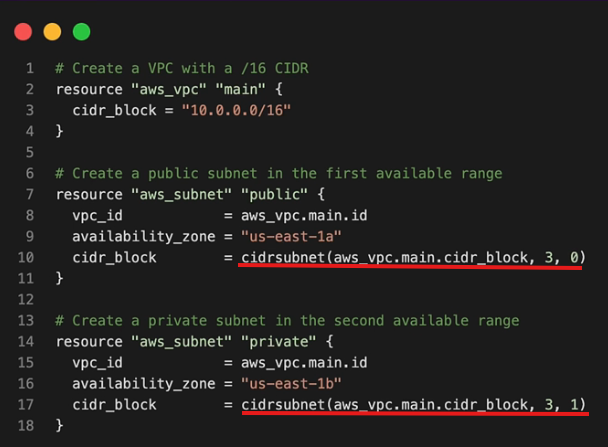

## numeric functions 
Quickly evaluate numeric values
* min
* max

## String functions
Concatenate or encode data for resource names, user data
* join
* split
* upper

join("-", ["prod", "web", "us-west-1"]) -> prod-web-us-west-1
replace("123-abc", "abc", "xyz")
base64encode("my-secret-data") -> "base64encodedstring"

## Type Conversions
Ensure consistent data structures across your configuration and avoid type mismatch issues
* toset
* tolist
* tomap
* tostring

## General syntax for tf functions
function_name(argument_1, argument_2s)
* upper("hello") -> returns "HELLO"
* min(4,7,2,9,5) -> return 2
* join("-", "hello", "terraform") -> "hello-terraform"

## network functions
useful functions to work with IP addresses and subnets

* Automate CIDR calculations
* Reduce manual errors
* scalable network design

