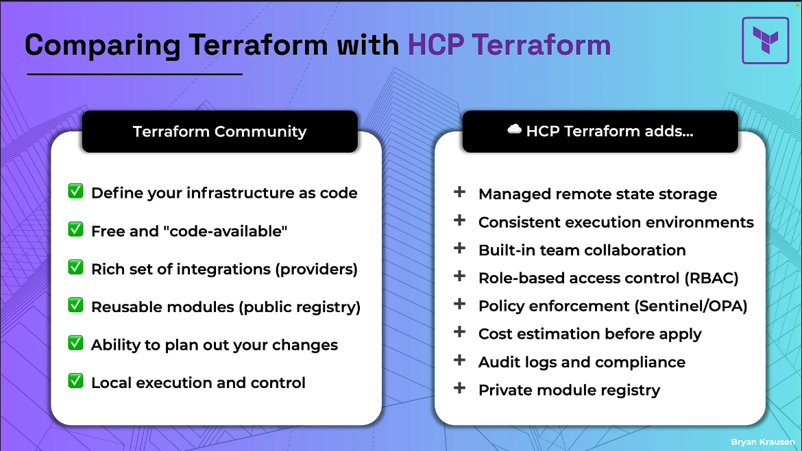

## Hashicorp Cloud Platform

HCP terraform is a hosted service that helps team use terraform to provision infrastructure.

* Enabling collaboration
* Remote state management
* Automate workflows

## The Value of HCP terraform 

#### Secure state storage

* Single source of truth
* Encrypted at rest
* State locking buit-in

#### Team collaboration

* Shared workspaces
* Role-based access control
* Audit Logs

#### Remote execution

* Consistent environments
* No local dependencies
* Reliable runs

#### Governance and policy

* Policy enforcement - catch errors before they reach production
* Cost estimation - get cost estimation before applying your changes 
* drift detection

## Comparing terraform to HCP terraform

## HCP tiers

#### Free Tier

* State storage and basic features
* Includes 500 managed resources at no charge

#### Essentials

* Access to more features
* Includes Stacks
* Unlimited applies

#### Standard

* For enterprises
* Drift detection 
* Golden patterns
* Audit Events
* Policy Enforcement

#### Premium 

* Multi-Cloud Enterprise
* Private VCS, Run tasks, Module revocation
