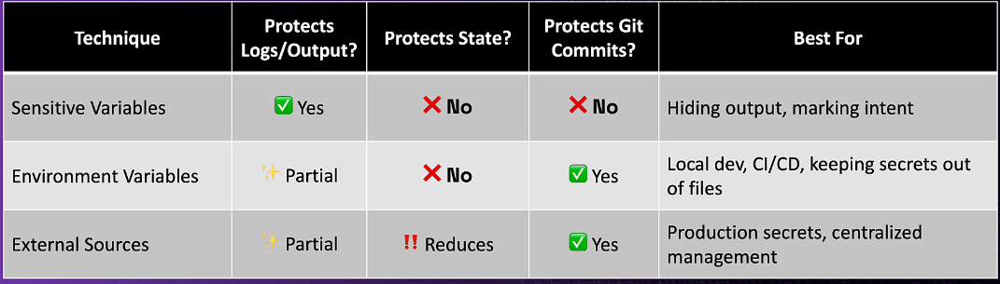
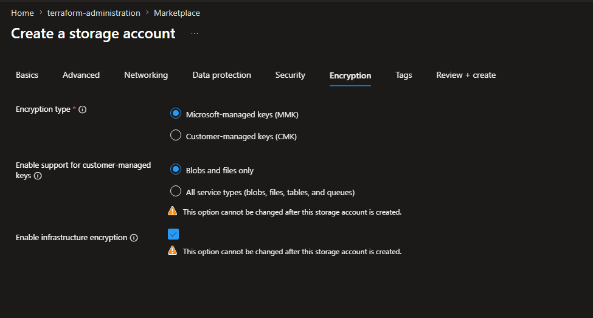

## Security

Terraform needs tp know everything about your infrastructure in order to manage it, however most of the time your secrets could end up exposed thru your state file, output logs, version control system, plan files, CI/CD pipelines etc.

Here que have some methods to hide our secrets and avoid exposing them in undesired places.

## Sensitive variables

Hide values in outputs and logs

this will only protect these variables and outputs from being exposed thru you console logs (outputs from terraform plan - apply)

Add "sensitive" parameter in the sensitive variables and outputs.

## Environment variables

Keep secrets out of version control

export TF_VAR_variable_name="value"

## External secret sources

Don't store secrets in terraform at all.

## Quick reference

### Note about encryption in azure

All data stored in azure storage is encrypted at rest by default, the recommended approach to stora encrypted infrastructure in storage accounts is by adding the following configuration to your storage account:

## Security checklist to protect state file

* Use sensitive parameter in variables and outputs whenever possible
* protect your sensitive parameters thru environment variables
* gather sensitive parameters from external secret providers such us azure keyvault, aws secret manager and so on
* Always use remote state
* Enable encryption at rest in your backend
* Implement access controls in your backend
* Enable state locking

## Ephemeral values

You can mark variables and outputs as ephemeral values by setting ephemeral = true in each variable, this will avoid persistence of terraform variable and output values in state file

Use ephemeral block when:
1. Fetching secrets from vaults
2. Reading temporary credentials
3. Retrieving dynamic tokens that change frequently

ephemeral block should only be used with Write-Only arguments, these arguments let you securely pass values to terraform's managed resource during an operation without persisting its actual value 